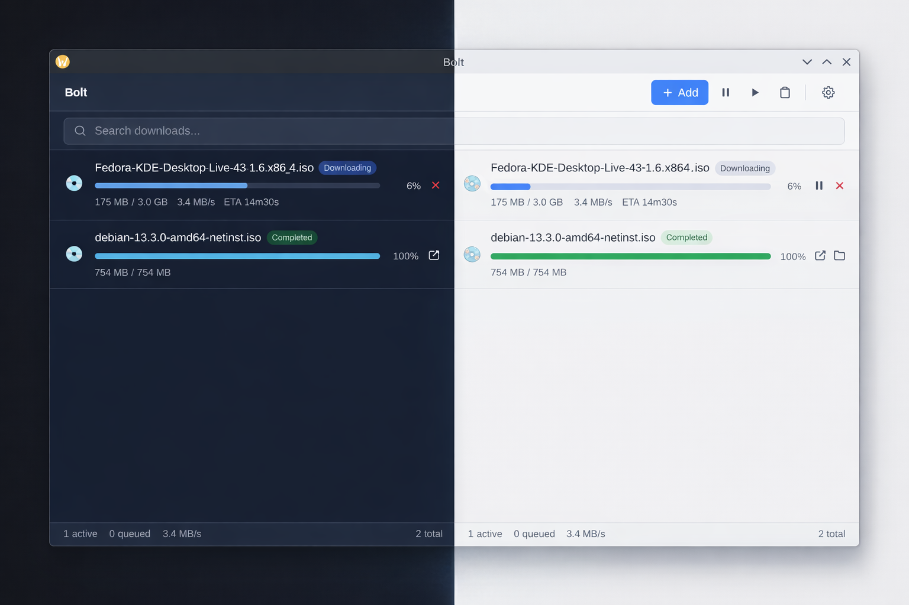

<p align="center">
  
</p>

<p align="center">
  <strong>Work in progress.</strong> Core engine, HTTP API, CLI, GUI, and browser extensions are functional. Working toward a stable v1.0 release.
</p>

## Features

- **Segmented downloading** — splits files into up to 32 concurrent connections (default 16)
- **Pause and resume** — segment progress persists to SQLite, survives process restarts
- **Auto-retry** — per-segment exponential backoff for transient failures
- **Download queue** — configurable max concurrent downloads with FIFO scheduling
- **Speed limiter** — global rate limiting across all active segments
- **Dead link refresh** — automatic URL renewal for expired CDN links
- **Dark theme** — system, light, and dark modes with live switching
- **Desktop notifications** — completion and failure alerts via native OS notifications
- **Browser extensions** — Chrome and Firefox extensions intercept downloads and send them to Bolt
- **REST API** — full CRUD over HTTP for scripting and extension integration
- **WebSocket** — real-time progress push
- **System tray** — minimize to tray, background operation
- **CLI** — manage downloads from the terminal

## Screenshots



## Quick Start

### Prerequisites

**Fedora:**

```bash
sudo dnf install golang gtk3-devel webkit2gtk4.1-devel gcc-c++ pnpm
go install github.com/wailsapp/wails/v2/cmd/wails@latest
```

**Ubuntu / Debian:**

```bash
sudo apt install golang libgtk-3-dev libwebkit2gtk-4.1-dev build-essential pnpm
go install github.com/wailsapp/wails/v2/cmd/wails@latest
```

**Arch:**

```bash
sudo pacman -S go gtk3 webkit2gtk-4.1 pnpm
go install github.com/wailsapp/wails/v2/cmd/wails@latest
```

Verify your environment with `wails doctor`.

### Build

```bash
git clone https://github.com/fhsinchy/bolt.git
cd bolt
make build
```

This builds the frontend, embeds it into the Go binary, and produces a `./bolt` executable.

### Run

```bash
./bolt              # launch the GUI
./bolt start --headless   # headless daemon (no window)
```

## CLI Usage

The CLI communicates with the running daemon over HTTP. Start the GUI or headless daemon first.

```bash
# Add a download
bolt add "https://example.com/file.iso"
bolt add "https://example.com/file.iso" --segments 8 --dir ~/Downloads

# List downloads
bolt list
bolt list --status active

# Control downloads
bolt pause <id>
bolt resume <id>
bolt cancel <id>
bolt cancel <id> --delete-file

# Check status
bolt status <id>

# Update an expired URL
bolt refresh <id> "https://example.com/new-url"

# Stop the daemon
bolt stop
```

## Browser Extension

Bolt ships browser extensions for Chrome and Firefox that intercept downloads and forward them to the running daemon.

**Chrome:** Open `chrome://extensions`, enable Developer mode, click "Load unpacked", and select `extensions/chrome/`.

**Firefox:** Open `about:debugging#/runtime/this-firefox`, click "Load Temporary Add-on", and select any file inside `extensions/firefox/`.

The extension popup lets you configure the server URL and auth token. On first install, a welcome page walks you through setup.

## Development

```bash
make dev           # hot-reload GUI development (wails dev)
make test          # run all tests
make test-race     # run tests with race detector
make test-v        # verbose test output
make test-stress   # include stress tests (~2 min)
make test-cover    # generate coverage report
make clean         # remove binary and clear caches
```

Tests do not require Wails build tags or CGO — `go test ./...` works on any system with Go installed.

## Architecture

Bolt runs as a single binary with three modes:

- **GUI mode** (default) — Wails window + system tray + HTTP server + download engine
- **Headless mode** (`--headless`) — HTTP server + download engine, no window
- **CLI client mode** (`bolt add`, `bolt list`, etc.) — HTTP client that talks to the running daemon

```
cmd/bolt/           Entry point and mode dispatch
internal/
  engine/           Download engine (segmented downloading, retry, resume)
  queue/            Queue manager (concurrency control)
  server/           HTTP server (REST API + WebSocket)
  app/              Wails IPC bindings
  db/               SQLite data access layer
  config/           Configuration management
  event/            Event bus (pub/sub)
  cli/              CLI HTTP client
  pid/              PID file management
  tray/             System tray
  model/            Shared types
frontend/           Svelte 5 + TypeScript + Tailwind CSS
```

## Roadmap

| Phase | Description | Status |
|-------|-------------|--------|
| 1. Engine + CLI | Segmented downloads, pause/resume, retry, queue, CLI | Complete |
| 2. HTTP Server | REST API, WebSocket progress, daemon mode | Complete |
| 3. Desktop GUI | Wails app, system tray, Svelte frontend | Complete |
| 4. Browser Extension | Chrome + Firefox download interception | Complete |
| 5. P1 Features | Speed limiter, dark theme, notifications, keyboard shortcuts, batch import | In progress |
| 6. P2 Features | Checksum verification, download scheduling, clipboard monitoring | Planned |
| 7. P3 Features | Proxy support, file categorization, auto-shutdown | Planned |

See `STATUS.md` for detailed per-feature status.

## Building on Other Platforms

Bolt uses Go and Wails, which support macOS and Windows. While official builds target Linux only, you can build from source on other platforms:

**macOS:**

```bash
# Install prerequisites
brew install go node pnpm
go install github.com/wailsapp/wails/v2/cmd/wails@latest

# Build
wails build
```

Requires Xcode command line tools (`xcode-select --install`).

**Windows:**

```powershell
# Install prerequisites: Go, Node.js, pnpm
# WebView2 runtime (included in Windows 11, install separately on Windows 10)
go install github.com/wailsapp/wails/v2/cmd/wails@latest

# Build
wails build
```

Run `wails doctor` to verify your environment on any platform.

## Tech Stack

| Component | Technology |
|-----------|------------|
| Backend | Go 1.23+ |
| GUI framework | Wails v2 |
| Frontend | Svelte 5, TypeScript 5, Vite 6, Tailwind CSS 4 |
| Database | SQLite via `modernc.org/sqlite` (pure Go, no CGO) |
| WebSocket | `nhooyr.io/websocket` |
| System tray | `energye/systray` |
| ID generation | ULID via `github.com/oklog/ulid/v2` |

## License

*TBD*
